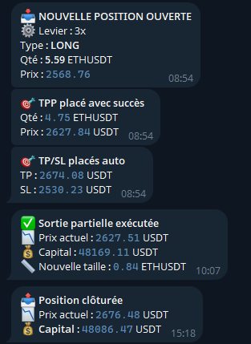
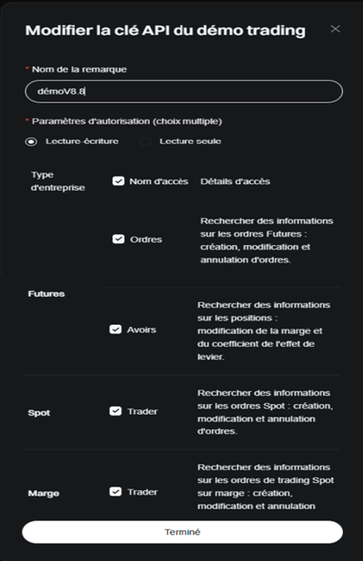

# 🤖 Bitget Trading Bot V8.9


## ⚠️Utilisé à ses propres risques⚠️
> 🇬🇧 Read in English: [README.md](README.md)

Bot de trading automatisé pour la plateforme **Bitget**, écrit en **Python**.  
Il utilise une stratégie combinée **Bollinger Bands + RSI**, avec gestion intelligente du **Take Profit**, **Stop Loss** et **TP partiel**.  
Le bot peut s’exécuter en **mode test/démo** ou **réel**, avec notifications **Telegram**.

---

## ⚠️ Prérequis & Compatibilité

- Un compte [Bitget](https://www.bitget.com/)
- Ce bot est conçu pour le **trading sur contrats Futures uniquement** (pas Spot).
- Il fonctionne uniquement avec des **paires en USDT**, comme `BTCUSDT`, `ETHUSDT`, etc.
- Nécessite un compte Bitget avec des clés API Futures (en mode démo ou réel).
- Python 3.9 ou version supérieure recommandé.

## 🚀Fonctionnalités principales de ton bot

🧠 **Stratégie de trading**
- Implémentation de RSI (Relative Strength Index)
- Implémentation des bandes de Bollinger
- Filtre de volatilité dynamique (width + seuils)
- Combinaison logique des 3 pour générer un signal d’achat/vente (LONG/SHORT)
- Mode test forcé (TEST_MODE + TEST_SIDE)

💹 **Gestion des positions**
- Ouverture d’ordre market (achat/vente)
- Calcul automatique de la taille de position en fonction du capital dispo, levier, et prix
- Détection si une position est déjà ouverte
- Détection de position partielle ou clôturée
- Affichage des informations de position en cours (prix, taille, TP/SL/TPP)

🎯 **Gestion du risque**
- Placement de Take Profit (TP) et Stop Loss (SL) complets
- Placement de Take Profit Partiel (TPP) (quantité + prix)
- Repose automatique du TP/SL s’ils sont absents
- Protection contre levier mal configuré / mauvaise marge

🌐 **Intégration API Bitget**
- Appels GET/POST signés avec HMAC pour sécurité
- Utilisation de CCXT pour charger les bougies futures
- Support des environnements demo et mainnet
- Gestion des erreurs API (code 40725, erreurs réseau, réponses vides)

📊 **Observabilité & interface**
- Dashboard console avec :
- prix mark
- capital disponible
- PnL non réalisé
- marges
- Logs locaux avec logging structuré
- Affichage des conditions d’indicateurs (diagnostic visuel)
- Résumés de signaux détectés / pris / ignorés
- Nettoyage automatique de la console tous les X cycles

📩 **Alerte & monitoring**
- Envoi d’alertes Telegram :
- nouvelles positions
- TP/SL posés
- erreurs API
- sortie partielle / totale
- perte de connexion Internet
- Système de détection de bug silencieux via logs et alertes

⚙️ **Architecture / robustesse**
- Gestion de retries sur erreurs réseau
- Vérification de la connectivité Bitget
- Contrôle global du cycle de vie du bot
- Mode automatique : attend, détecte, agit seul
- Lancement principal via __main__ avec print d’en-tête

## 🧱 Architecture du bot

Le bot est organisé autour de modules robustes :

- **Analyse de marché** : récupération des bougies avec CCXT + calcul Bollinger/RSI
- **Détection de signal** : stratégie personnalisable (`check_signal_bb_rsi`)
```
==================================================
✅ RSI faible : 25,71 < 60
📏 Bande supérieure : 2 698,01, Bande inférieure : 2 647,63, MMS : 2 672,82
⚠️ Faible volatilité : largeur 0,0189 ≤ seuil 0,0270
➡️ Prix entre les bandes : 2 661,57
👀 En attente du prochain signal…
==================================================
```
- **Exécution des ordres** : market order + gestion du mode marge et levier
- **Protection des positions** : TP/SL automatiques, TPP (Take Profit Partiel)
- **Surveillance continue** : dashboard en direct, affichage console dynamique
```
 ⚙️  Levier réglé : 3x
 ================== Version 8.8 ==================
 📅 2025-05-27 21:03:49 | Prix ETHUSDT : 2676.00 USDT
 🏦 Total capital       : 5109.23 USDT
 💰 Solde en USDT       : 5222.44 USDT
 💸 disponible          : 138.73 USDT
 ⚖️ P&L non réalisé    : 113.21 USDT
 📏 Initial Margin      : 4970.50 USDT
 📊 Initial Margin %    : 97.28 %
 ==================================================
 📌 Position  : SHORT | Entrée : 2696.47 | Qté : 5.53 ETHUSDT
 🎯 TP actif  : 2669.51
 🛡️ SL actif  : 2736.92
 🔄 Sortie partielle : en attente
 ```
- **Communication** : notifications Telegram, logs locaux


---

## 🧩 Stratégie personnalisable

Le bot repose par défaut sur une stratégie technique éprouvée combinant trois outils :

🔷 **1. Bandes de Bollinger (Bollinger Bands)**
- Permettent de visualiser les zones de **surachat/survente** en fonction de la volatilité.
- Le bot détecte les **cassures** de bande (breakouts), ce qui peut signaler une entrée potentielle.

🔶 **2. RSI (Relative Strength Index)**
- Utilisé pour **filtrer les faux signaux**.
- Le RSI doit confirmer la dynamique :
- 📈 Pour un **LONG**, on attend que le RSI dépasse un seuil (ex. > 40).
- 📉 Pour un **SHORT**, on attend qu’il passe sous un seuil (ex. < 60).

♦️ **3. Filtre de volatilité (propre au bot)**
- Calcul basé sur la **largeur des bandes de Bollinger**.
- Le trade est autorisée uniquement si la volatilité est suffisante, pour éviter les marchés plats.


Mais il est **conçu pour être facilement modifiable** :  
➡️ Vous pouvez adapter **votre propre stratégie de trading**, sans toucher au cœur du bot.

## 🔁 Comment faire ?

Dans le fichier `BitgetBotV8.8.py`, la fonction suivante détermine les signaux :

```python
def check_signal_bb_rsi(df):
    ...
    return "LONG", "SHORT", ou None

```

## 📦 Installation
```
git clone https://github.com/jerome78b/bitget-trading-bot.git
```
```
cd bitget-trading-bot
```
```
python -m venv venv
```
```
pip install -r requirements.txt
```
---

## 🛠️ Configuration & Variables

Vous pouvez personnaliser le bot en modifiant les variables situées en haut du fichier `BitgetBot.py`.

Voici les principales variables de configuration et leur rôle :  

🧰 **Configuration générale du bot**

| Variable             | Type    | Description                                                                          |
| -------------------- | ------- | ------------------------------------------------------------------------------------ |
| `USE_DEMO`           | `bool`  | `True` = mode démo (testnet), `False` = trading réel                                 |
| `TEST_MODE`          | `bool`  | `True` = force un trade à chaque cycle (test), `False` = exécute la stratégie réelle |
| `TEST_SIDE`          | `str`   | Côté de test si `TEST_MODE = True` (`'buy'` ou `'sell'`)                             |
| `SYMBOL`             | `str`   | Paire de trading, ex : `'ETHUSDT'`, `'BTCUSDT'`                                      |
| `TIMEFRAME`          | `str`   | Période des bougies utilisées, ex : `'1m'`, `'15m'`, `'1h'`                          |
| `LEVERAGE`           | `int`   | Levier appliqué aux positions, ex : `'3'` = levier X3 sur la position                |
| `MARGIN_MODE`        | `str`   | Mode de marge utilisé : `'crossed'` ou `'isolated'`                                  |
| `CYCLE_COUNT`        | `int`   | Nombre de cycles avant nettoyage automatique de la console                           |
| `LOOP_INTERVAL`      | `int`   | Temps (en secondes) entre chaque boucle principale du bot                            |
| `TRACK_SIGNALS`      | `bool`  | `True` = active le suivi des signaux, `False` = le désactive                         |
| `TELEGRAM_ENABLED`   | `bool`  | `True` = envoie des alertes via Telegram, `False` = aucune notification              |

🎯 **Paramètres de gestion des positions & stratégie** 

| Variable                 | Type    | Description                                                                      |
| ------------------------ | ------- | -------------------------------------------------------------------------------- |
| `CAPITAL_ENGAGEMENT`     | `float` | Pourcentage du capital à engager par trade (ex : `0.10` pour 10%)                |
| `USE_TPP`                | `bool`  | `True` = active le Take Profit Partiel (TPP), `False` = le désactive entièrement |
| `TRAIL_TRIGGER`          | `float` | Seuil (%) de déclenchement du trailing stop pour le TPP (ex: `0.023` pour 2.3%)  |
| `PARTIAL_EXIT_FRACTION`  | `float` | Pourcentage de la position à sortir partiellement (ex: `0.85` pour 85%)          |
| `TP_PERCENT_LONG`        | `float` | Pourcentage de Take Profit pour les positions long (ex: `4.1`)                   |
| `SL_PERCENT_LONG`        | `float` | Pourcentage de Stop Loss pour les positions long (ex: `1.5`)                     |
| `TP_PERCENT_SHORT`       | `float` | Pourcentage de Take Profit pour les positions short (ex: `4.0`)                  |
| `SL_PERCENT_SHORT`       | `float` | Pourcentage de Stop Loss pour les positions short (ex: `1.5`)                    |

📊 **Paramètres des indicateurs techniques**

| Variable             | Type    | Description                                                                          |
| -------------------- | ------- | ------------------------------------------------------------------------------------ |
| `BOLL_PERIOD`        | `int`   | Période utilisée pour le calcul des **Bandes de Bollinger** (ex : `34`)              |
| `BOLL_MULT`          | `float` | Multiplicateur de l’écart-type pour définir la largeur des bandes                    |
| `RSI_PERIOD`         | `int`   | Période pour le calcul du **RSI** (Relative Strength Index)                          |
| `RSI_HIGH_THRESHOLD` | `int`   | Seuil à partir duquel le RSI valide un signal **LONG** (ex : `> 40`)                 |
| `RSI_LOW_THRESHOLD`  | `int`   | Seuil en dessous duquel le RSI valide un signal **SHORT** (ex : `< 60`)              |
| `WIDTH_PERIOD`       | `int`   | Période utilisée pour mesurer la **largeur des bandes** (filtre de volatilité)       |
| `VOL_MULT`           | `float` | Multiplicateur appliqué à la volatilité pour confirmer les conditions d’entrée       |


## ✏️ Configuration
```
API_KEY = "your_api_key"
API_SECRET = "your_api_secret"
PASSPHRASE = "your_passphrase"
TELEGRAM_TOKEN = "your_telegram_token"
TELEGRAM_CHAT_ID = "your_chat_id"
```

## 🔐 Configuration des clés API Bitget ⚠️

Pour que le bot fonctionne correctement, vous devez générer une clé API Bitget avec les autorisations appropriées.  
👉 Rendez-vous dans **API Management Bitget**.  
➡️ Cliquez sur **"Créer une clé API"** ou **modifiez une clé existante**.  
✅ Sélectionnez les autorisations suivantes : 
 


💡 **Ces droits sont nécessaires pour que le bot puisse :**  

- Récupérer les positions
- Placer/modifier les ordres TP/SL
- Gérer le levier et le mode de marge
- Suivre l’équity et les performances en live

## ❓ Pourquoi utiliser ce bot ?

Ce projet a été conçu pour rendre le **trading automatisé sur Bitget simple, modulable et prêt à l’emploi**, notamment pour les débutants ou les profils QA/développeurs qui souhaitent :

- ✅ Un exemple fonctionnel complet d’intégration avec l’API Bitget
- 🧠 Un système de stratégie personnalisable (remplacez facilement la logique)
- 🧪 Un mode TEST intégré pour simuler des trades sans risque
- 💬 Des alertes en temps réel via Telegram
- 📊 Un tableau de bord clair avec les prix, l’équity et l’état des positions
- 🔐 Une gestion robuste des erreurs (déconnexions Internet, erreurs API...)

Au lieu de partir de zéro avec les SDK ou l’API brute, ce bot vous permet de **vous concentrer sur votre stratégie**, pas sur la configuration technique.

Idéal pour :
- 👨‍💻 Les développeurs qui veulent une base propre orientée QA
- 📈 Les traders qui veulent automatiser leurs entrées RSI + Bollinger
- 🧪 Ceux qui apprennent à construire ou tester une stratégie crypto automatisée

---

## 📄 Licence
Ce projet est sous licence MIT – libre d’utilisation, modification et distribution.

## ⭐ Soutenir le projet

Si ce bot vous a été utile ou vous semble intéressant, vous pouvez lui donner une **⭐ étoile** sur GitHub !

Cela m’aide à gagner en visibilité, à rester motivé, et à faire évoluer ce projet open-source.

➡️ [Ajouter une étoile ici](https://github.com/jerome78b/bitget-trading-bot/stargazers) 🙏

## 🙋‍♂️ À propos

Ce projet a été développé dans le cadre d'une démonstration de compétences en **tests QA**, **développement Python** et **automatisation**.  
N'hésitez pas à me contacter si vous êtes recruteur ou intéressé par un projet technique.

📬 **Me contacter** :  
[](https://github.com/jerome78b)
[](https://www.linkedin.com/in/jerome-bauché)
