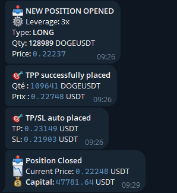

# 🤖 Bitget Trading Bot V8.9


## ⚠️ Used at one's own risk ⚠️
> 🇫🇷 Lire en français : [README.FR.md](README.FR.md)
> 
Automated trading bot for the **Bitget** platform, written in **Python**.  
It uses a combined strategy of **Bollinger Bands + RSI**, with smart management of **Take Profit**, **Stop Loss**, and **Partial Take Profit (TPP)**.  
The bot can run in **test/demo mode** or in **live trading**, with **Telegram notifications**.

---

## ⚠️ Requirements & Compatibility

- And account [Bitget](https://www.bitget.com/)
- This bot is designed for **Futures trading only** on Bitget (not Spot).
- Only compatible with **USDT-based pairs**, such as `BTCUSDT`, `ETHUSDT`, etc.
- Requires a Bitget account with Futures API keys (demo or mainnet).
- Python 3.9 or higher is recommended.
  
## 🚀 Main Features 

🧠 **Trading Strategy**
- RSI (Relative Strength Index) implementation
- Bollinger Bands implementation
- Dynamic volatility filter (bandwidth + thresholds)
- Logical combination of the 3 indicators to generate LONG/SHORT signals
- Forced test mode (TEST_MODE + TEST_SIDE)

💹 **Position Management**
- Market order execution (buy/sell)
- Automatic position sizing based on available capital, leverage, and price
- Detection of already open positions
- Detection of partial or closed positions
- Display of active position info (entry price, size, TP/SL/TPP)

🎯 **Risk Management**
- Placement of full Take Profit (TP) and Stop Loss (SL) orders
- Placement of Partial Take Profit (TPP) with custom quantity and price
- Automatic re-placement of TP/SL if missing
-Protection against misconfigured leverage or margin mode

🌐 **Bitget API Integration**
- Signed GET/POST requests using HMAC for security
- Uses CCXT to fetch futures candles
- Supports both demo and mainnet environments
-Handles API errors (e.g., code 40725, network errors, empty responses)

📊 **Observability & Interface**
- Console dashboard with:
- mark price
- available capital
- unrealized PnL
- margin metrics
- Local structured logging
- Visual indicator diagnostics in console
- Summary of detected / executed / ignored signals
- Auto-clears the console every X cycles

📩 **Alerts & Monitoring**
- Telegram alerts for:
- new positions
- TP/SL placement
- API errors
- partial/full exits
- Internet connection loss
- Silent bug detection system via logs and alerts

⚙️ **Architecture & Robustness**
- Retry handling for network issues
- Bitget connectivity check
- Full lifecycle control of the bot
- Fully autonomous mode: waits, detects, acts
- Main entry point via __main__ with startup banner

## 🧱 Bot Architecture

The bot is structured around robust modules:

- **Market Analysis**: Fetches candles using CCXT + calculates Bollinger Bands and RSI
- **Signal Detection**: Customizable strategy (`check_signal_bb_rsi`)
```
==================================================
✅ Low RSI    : 25.71 < 60
📏 Upper Band: 2698.01, Lower Band: 2647.63, SMA: 2672.82
⚠️ Low volatility: width 0.0189 ≤ threshold 0.0270
➡️ Price between bands: 2661.57
👀 Waiting for the next signal...
==================================================
```
- **Order Execution**: Market orders + margin mode and leverage management
- **Position Protection**: Automated TP/SL and TPP (Partial Take Profit)
- **Continuous Monitoring**: Live dashboard with dynamic console display
```
 ⚙️ Leverage set : 3x
 ================== Version 8.9 ==================
 📅 2025-05-27 21:03:49 | Prix ETHUSDT : 2676.00 USDT
 🏦 Total capital       : 5109.23 USDT
 💰 USDT Balance       : 5222.44 USDT
 💸 Available Funds     : 138.73 USDT
 ⚖️ Unrealized P&L     : 113.21 USDT
 📏 Initial Margin      : 4970.50 USDT
 📊 Initial Margin %    : 97.28 %
 ==================================================
 📌 Position  : SHORT | Entrée : 2696.47 | Qté : 5.53 ETHUSDT
 🎯 TP actif  : 2669.51
 🛡️ SL actif  : 2736.92
 🔄 Sortie partielle : en attente
 ```
- **Communication** : notifications Telegram, logs locaux


---

## 🧩 Customizable strategy

The bot is based by default on a proven technical strategy that combines three key tools:

🔷 **1. Bollinger Bands**
- Used to visualize **overbought/oversold** zones based on market volatility.
- The bot looks for **band breakouts**, which can indicate a potential trade entry.

🔶 **2. RSI (Relative Strength Index)**
- Helps **filter out false signals**.
- RSI must confirm the trend direction:
  - 📈 For a **LONG** entry, RSI must rise above a threshold (e.g., > 40).
  - 📉 For a **SHORT** entry, RSI must fall below a threshold (e.g., < 60).

♦️ **3. Volatility Filter (bot-specific)**
- Based on the **width of the Bollinger Bands**.
- Trades are only allowed when volatility is high enough, helping avoid flat market conditions.

But it's **designed to be easily modified**:  
➡️ You can adapt **your own trading strategy** without touching the bot's core logic.

## 🔁 How to do it?

In the `bitget_bot.py` file, the following function determines the signals:

```python
def check_signal_bb_rsi(df):
    ...
    return "LONG", "SHORT", or None

```

## 📦 Installation
```
git clone https://github.com/jerome78b/bitget-trading-bot.git
```
```
cd bitget-trading-bot
```
```
python -m venv venv
```
```
pip install -r requirements.txt
```
---

## 🛠️ Configuration & Variables

You can customize the bot directly by editing the top of the `BitgetBot.py` script.

Here are the key configuration variables and what they do:  

🧰 **General Bot Configuration**

| Variable           | Type   | Description                                                                     |
| ------------------ | ------ | ------------------------------------------------------------------------------- |
| `USE_DEMO`         | `bool` | `True` = demo mode (testnet), `False` = live trading                            |
| `TEST_MODE`        | `bool` | `True` = forces a trade every cycle (for testing), `False` = runs real strategy |
| `TEST_SIDE`        | `str`  | Trade side if `TEST_MODE = True` (`'buy'` or `'sell'`)                          |
| `SYMBOL`           | `str`  | Trading pair, e.g., `'ETHUSDT'`, `'BTCUSDT'`                                    |
| `TIMEFRAME`        | `str`  | Candle timeframe, e.g., `'1m'`, `'15m'`, `'1h'`                                 |
| `LEVERAGE`         | `int`  | Leverage applied to positions, e.g., `'3'` = 3x leverage                        |
| `MARGIN_MODE`      | `str`  | Margin mode: `'crossed'` or `'isolated'`                                        |
| `CYCLE_COUNT`      | `int`  | Number of cycles before automatic console cleanup                               |
| `LOOP_INTERVAL`    | `int`  | Time (in seconds) between each main loop iteration                              |
| `TRACK_SIGNALS`    | `bool` | `True` = enable signal tracking, `False` = disable it                           |
| `TELEGRAM_ENABLED` | `bool` | `True` = send alerts via Telegram, `False` = no notifications                   |

🎯 **Position Management & Strategy Settings**

| Variable                | Type    | Description                                                             |
| ----------------------- | ------- | ----------------------------------------------------------------------- |
| `CAPITAL_ENGAGEMENT`    | `float` | Percentage of capital to allocate per trade (e.g., `0.10` for 10%)      |
| `USE_TPP`               | `bool`  | `True` = enables Partial Take Profit (TPP), `False` = fully disables it |
| `TRAIL_TRIGGER`         | `float` | Trailing stop trigger threshold (e.g., `0.023` for 2.3%)                |
| `PARTIAL_EXIT_FRACTION` | `float` | Portion of the position to exit partially (e.g., `0.85` for 85%)        |
| `TP_PERCENT_LONG`       | `float` | Take Profit percentage for long positions (e.g., `4.1`)                 |
| `SL_PERCENT_LONG`       | `float` | Stop Loss percentage for long positions (e.g., `1.5`)                   |
| `TP_PERCENT_SHORT`      | `float` | Take Profit percentage for short positions (e.g., `4.0`)                |
| `SL_PERCENT_SHORT`      | `float` | Stop Loss percentage for short positions (e.g., `1.5`)                  |

📊 **Technical Indicator Settings**

| Variable             | Type    | Description                                                          |
| -------------------- | ------- | -------------------------------------------------------------------- |
| `BOLL_PERIOD`        | `int`   | Period used for **Bollinger Bands** calculation (e.g., `34`)         |
| `BOLL_MULT`          | `float` | Standard deviation multiplier to set the width of Bollinger Bands    |
| `RSI_PERIOD`         | `int`   | Period used for calculating the **RSI** (Relative Strength Index)    |
| `RSI_HIGH_THRESHOLD` | `int`   | Threshold above which RSI confirms a **LONG** signal (e.g., `> 40`)  |
| `RSI_LOW_THRESHOLD`  | `int`   | Threshold below which RSI confirms a **SHORT** signal (e.g., `< 60`) |
| `WIDTH_PERIOD`       | `int`   | Period used to measure **bandwidth** (used as a volatility filter)   |
| `VOL_MULT`           | `float` | Multiplier applied to volatility to validate trade conditions        |


## ✏️ Configuration
```
API_KEY = "your_api_key"
API_SECRET = "your_api_secret" 
PASSPHRASE = "your_passphrase"
TELEGRAM_TOKEN = "your_telegram_token"
TELEGRAM_CHAT_ID = "your_chat_id"

```
## 🔐 Bitget API Key Configuration ⚠️

To ensure the bot works properly, you need to generate a Bitget API key with the correct permissions.  
👉 Go to Bitget **API Management**.  
➡️ Click on **"Create API Key"** or edit an existing key.  
✅ Select the following permissions :


💡 **These permissions are required for the bot to :**  

- Retrieve open positions
- Place/modify TP (Take Profit) and SL (Stop Loss) orders
- Manage leverage and margin mode
- Monitor equity and live performance

## ❓ Why use this bot?

This project is designed to make Bitget trading automation **simple, flexible, and ready to use**, especially for beginners or QA/dev profiles who want:

- ✅ A complete working example using the Bitget API (ready out-of-the-box)
- 🧠 A customizable strategy system (plug in your own logic easily)
- 🧪 Built-in test mode to simulate trades without real money
- 💬 Real-time Telegram alerts
- 📊 Clean live dashboard (price, equity, position status)
- 🔐 Resilience to Internet cuts with auto-recovery and safe error handling

Instead of starting from scratch with raw SDKs or low-level API calls, this bot helps you **focus on your strategy**, not on technical plumbing.

Perfect for:  
- 👨‍💻 Developers looking for a QA-friendly trading bot structure  
- 📈 Traders who want to automate RSI + Bollinger-based entries  
- 🧪 Anyone learning how to build and test automated crypto strategies
---

## 📄 Licence
This project is licensed under the MIT License – free to use, modify and distribute.

## ⭐ Support the Project

If you find this trading bot useful or interesting, feel free to give it a **⭐ star** on GitHub!

It helps increase visibility, motivates development, and supports this open-source work.

➡️ [Give it a star here](https://github.com/jerome78b/bitget-trading-bot/stargazers) 🙏

## 🙋‍♂️ About
This project was developed as part of a technical demonstration in **QA testing**, **Python development**, and **automation**.  
Feel free to reach out if you're a recruiter or interested in a technical collaboration.

[](https://github.com/jerome78b)
[](https://www.linkedin.com/in/jerome-bauché)

---


